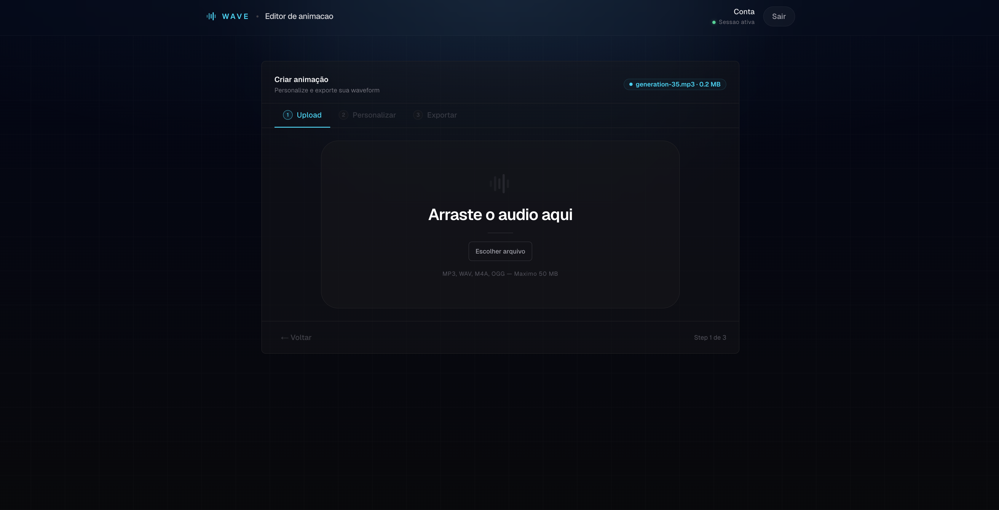

# Wave Audio Animation

Monorepo com frontend em Next.js e backend em FastAPI para gerar animacoes de audio.

## Preview



## Desenvolvimento

Na raiz do projeto:

```bash
npm run dev
```

Isso sobe:

- frontend em `http://localhost:3000`
- backend em `http://localhost:8000`

Comandos separados:

```bash
npm run dev:front
npm run dev:back
```

## Estrutura

- `frontend/`: app Next.js
- `backend/`: API FastAPI, processamento de audio e exportacao
